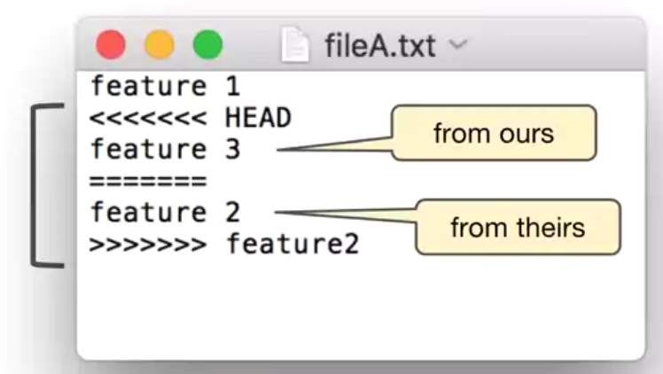

# Course: Version Control with Git

> Course site: [Version Control with Git by Atlassian](https://www.coursera.org/learn/version-control-with-git)

## Course Notes:

DevOps has a few fundamental principles that most modern software projects follow.

One of the key principles is to continuously plan, build and
release small improvements to your product. 

We have seen some of the ways that Git is fundamental to DevOps and modern software development.

Git manages many small improvements to the project using commits, it also allows simultaneous stability and development through branches and improves product quality using pull requests which can include review and testing. 

Version control enables team to manage a collection of files in an agile way. This collection of files is called a project and Git is flexible enough to manage many types of projects.

Git is a distributed version control system. This means that users work with local copies of the repository enabling them to work while offline and synchronize with other repositories at a later time.

For git config, 
- If the local value is set, it takes precedence.
- If a local value is not set, the global value takes precedence.
- If a global value is not set, the system value takes precedence. 

```sh
# all show only all branches
git log --oneline --graph [--all]

git tag -a -m "an annotated tag" tag-name

# create a branch and checkout to it
git branch <new-branch>
git checkout
# equiv one-liner
git checkout -b <new-branch>

# branch deletion and recovery
git branch -D <branch>
get reflog # see the history of HEAD ref
git check -b <branch> [SHA1 of the commit] # recover the branch before being garbage collected
```

Fast-forward merges: default mode, moves the base branch label to the tip of the topic branch. 
Fast-forwardable only if no other commits have been made to
the base branch since the topic branch was created. 

Merge commit is the result of combining the work of more than one commits, thus has multiple parents.
```sh
# no-ff means no fast forward even if fast forwardable
git checkout master
git merge [--no-ff] featureX
git branch -d featureX
```

Merge conflict can occur if different branches change the same hunk of a file in different ways. 



```sh
git checkout base
git merge featureX
# conflict occurs and the conflicted files in the working dir, you can 
# either, go back to the state before the merge attempt
git merge --abort
# or, handle conflict and commit
git add . && git commit -m "merge"
```

```sh
# view also the tracking branches, which are the local branches that represent remote branches (e.g. origin/master)
git branch --all
# view log of all local and tracking branches
git log --all
```

Network commands include clone, fetch, pull, and push commands.
- pull = fetch + merge
- ```git pull [--ff-only]```

```sh
# repoint <feature> to newest commit on <base>
# step: checkout <feature>, rebase onto <base>
git checkout <feature>
git rebase <base>
# equiv one-liner
git rebase <base> <feature>

# notice rebase is a form of merge, conflict can occur, you can
# either, abort the rebase
git rebase --abort
# or, resolved the conflict and continue the rebase
git rebase --continue

# amend the most recent commit msg
git commit --amend -m "new commit msg"
# amend the most recent commit content by staging
# no-edit means to keep the commit msg
git add file-to-amend.txt
git commit --amend [--no-edit]

# rewrite all children of <commit>
git rebase -i <commit>

# a squash merge
git checkout <base>
# remove all commits of <feature> and all changes are in stage
git merge --squash <feature>
git commit
git branch -D <feature>
```